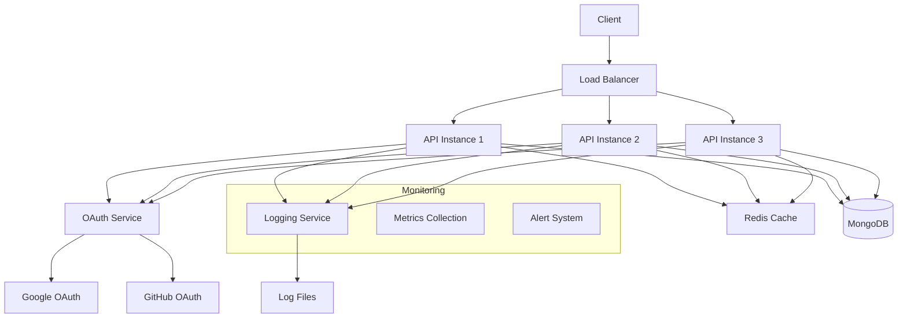

# TypeScript Microservice Boilerplate

A production-ready microservice boilerplate with TypeScript, Express, MongoDB, Redis, and OAuth2 authentication.

## Directory Structure

```
.
├── src/
│   ├── config/           # Configuration files
│   │   ├── index.ts     # Main config
│   │   └── oauth.ts     # OAuth config
│   ├── containers/       # Service containers
│   │   └── ServiceContainer.ts
│   ├── controllers/      # Request handlers
│   │   ├── auth.ts
│   │   └── user.ts
│   ├── interfaces/       # TypeScript interfaces
│   │   └── index.ts
│   ├── middleware/       # Express middleware
│   │   ├── auth.ts
│   │   └── error.ts
│   ├── models/          # Database models
│   │   └── User.ts
│   ├── routes/          # API routes
│   │   ├── auth.ts
│   │   └── user.ts
│   ├── services/        # Business logic
│   │   ├── AuthService.ts
│   │   ├── CacheService.ts
│   │   └── EmailService.ts
│   └── utils/           # Utility functions
│       ├── logger.ts
│       └── cache.ts
├── logs/                # Application logs
│   ├── info.log
│   ├── warn.log
│   ├── error.log
│   └── fatal.log
├── docker/             # Docker configurations
│   ├── api/
│   ├── mongodb/
│   └── redis/
└── tests/              # Test files
    ├── unit/
    └── integration/

## System Design



## Features

- 🔐 OAuth2 Authentication (Google & GitHub)
- 📊 Advanced Logging System (Info, Warn, Error, Fatal)
- 💾 Redis Caching with LRU
- 📦 MongoDB with Mongoose
- 🚀 Horizontal Scaling
- 📝 Swagger API Documentation
- 🐳 Docker & Docker Compose
- 🔍 Request Tracing
- ⚡ Rate Limiting
- 🛡️ Security Features

## Environment Variables

```env
# Server
PORT=3000
NODE_ENV=development

# MongoDB
MONGO_URI=mongodb://localhost:27017/microservice

# Redis
REDIS_URL=redis://localhost:6379

# OAuth
GOOGLE_CLIENT_ID=your_google_client_id
GOOGLE_CLIENT_SECRET=your_google_client_secret
GOOGLE_REDIRECT_URI=http://localhost:3000/auth/google/callback

GITHUB_CLIENT_ID=your_github_client_id
GITHUB_CLIENT_SECRET=your_github_client_secret
GITHUB_REDIRECT_URI=http://localhost:3000/auth/github/callback

# Email
EMAIL_HOST=smtp.example.com
EMAIL_PORT=587
EMAIL_USER=your-email@example.com
EMAIL_PASS=your-email-password

# Logging
LOG_LEVEL=info
LOG_DIR=./logs
```